# Online Learning Applications 2026 — Multi-Campaign Ad Bidding Under Budget Constraints

Project for the *Online Learning Applications* course (PoliMi). The goal, as stated in the
[official project brief](project.pdf), is to design online learning algorithms for an
advertising agency that bids, round after round, on **several ad campaigns at once through
first-price auctions, under a shared budget**. Each requirement below adds one layer of
difficulty on top of the same auction model: from a single campaign to many, from a
stochastic world to a non-stationary (even adversarial) one.

## The problem, in one picture

At every round the agency picks a bid for each campaign, the highest competing bid for that
campaign is revealed, and the agency wins whenever its bid is at least as high. A win pays
`v_i - b_i` (valuation minus bid) and costs `b_i`; a loss pays and costs nothing. Some
campaigns are direct competitors (think Coca-Cola vs. Pepsi) and can never be bid on in the
same round — this is encoded as a **conflict graph**, and a feasible action ("super-arm") is
an independent set of campaigns plus one bid per campaign in it.

All four requirements share the same generator for the competing bids: campaign `i` faces
`k_i` competitors bidding i.i.d. `Uniform(0,1)`, so the highest one follows a
`Beta(k_i, 1)` distribution and the probability that bid `b` wins is exactly `b^{k_i}`
(more competitors → steeper curve → you must bid higher to win).

| | |
|---|---|
|  |  |
| Theoretical win probability `b^{k_i}` vs. the empirical win frequency measured over the simulation, for three campaigns with `k = (2, 3, 5)`. | The conflict graph used from Requirement 2 onward: campaigns 2 and 3 are mutually exclusive, campaign 1 is compatible with both. |

## Repository layout

| Path | Contents |
|---|---|
| [`requirement_1.ipynb`](requirement_1.ipynb) | Requirement 1 — single campaign, stochastic environment |
| [`requirement_2.ipynb`](requirement_2.ipynb) | Requirement 2 — multiple campaigns, stochastic environment, conflict graph |
| [`requirement_3.ipynb`](requirement_3.ipynb) | Requirement 3 — best-of-both-worlds (stochastic + highly non-stationary) |
| [`requirement_4.ipynb`](requirement_4.ipynb) | Requirement 4 — slightly non-stationary environment |
| [`Images/`](Images) | Plots shared across notebooks and the slide deck |
| [`Latex_presentation/`](Latex_presentation) | Source of the presentation deck (`presentation.tex`) and its figures |
| [`Slides/`](Slides) | Course lecture slides used as theoretical background |
| [`Practical Sessions-20260724/`](Practical%20Sessions-20260724) | Course lab notebooks the algorithms below build on |
| [`project.pdf`](project.pdf) | Official project requirements handed out by the instructor |

## Requirement 1 — Single campaign, stochastic environment

**Notebook:** [`requirement_1.ipynb`](requirement_1.ipynb)

One campaign, one fixed valuation `v`, `k = 3` competitors bidding `Uniform(0,1)` i.i.d.
every round, so the highest competing bid is i.i.d. `Beta(3,1)`. Bids are restricted to a
small discrete grid `b ≤ v`, and feedback is *bandit*: we only learn whether our own bid won.

The notebook derives the clairvoyant baseline in closed form
(`b* = k/(k+1) · v`) both ignoring and respecting the budget (the budget turns out not to
bind in the tested configuration, so both baselines coincide), then implements two learners:

- **UCB1 ignoring the budget** — plain UCB1 over the discrete bids, confidence radius scaled
  by `v` since rewards live in `[0, v]`.
- **UCB1 with the budget constraint** — at every round it builds a UCB estimate of the reward
  and an LCB estimate of the cost for each bid, solves a small LP for the best mixed strategy
  under the per-round budget rate `ρ = B/T`, samples a bid from it, and stops bidding once the
  budget is exhausted.

| | | |
|---|---|---|
|  | 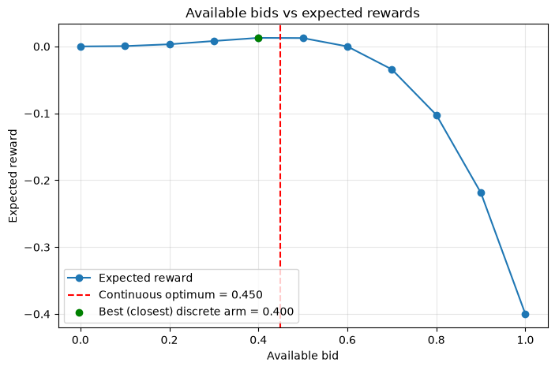 | 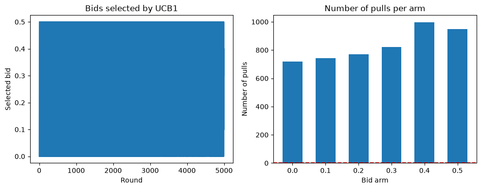 |
| Win probability `b^3` vs. empirical frequency over 5000 rounds. | Expected reward `μ(b)` per bid — `0.4` and `0.5` are almost equally good. | Bids chosen by UCB1 over time and pulls per arm. |
| 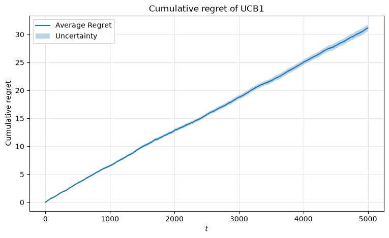 | 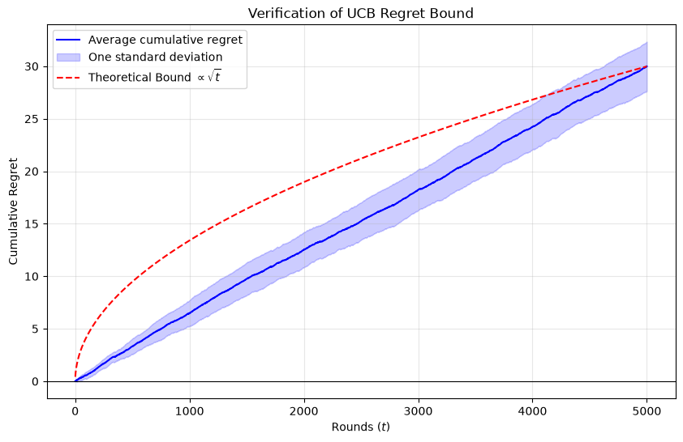 | |
| Cumulative regret of UCB1 ignoring the budget (30 trials). | Cumulative regret of the budgeted UCB-like learner (30 trials) against a `√t` reference. | |
| 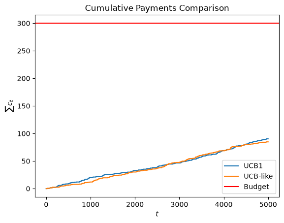 | 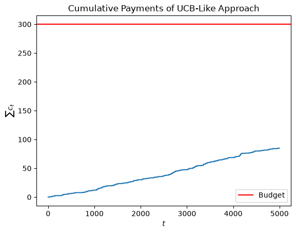 | |
| Cumulative payments: UCB1 vs. the budgeted agent (single run). | Cumulative payment against the budget line — the budget is far from binding here. | |

## Requirement 2 — Multiple campaigns, stochastic environment

**Notebook:** [`requirement_2.ipynb`](requirement_2.ipynb)

Now there are `N = 3` campaigns sharing **one** budget, each with its own valuation `v_i` and
its own number of competitors `k_i`. Per round the agency plays a super-arm `(S, b_S)`: a set
of campaigns `S` (compatible under the conflict graph) plus one bid per campaign in `S`.
Feedback is *semi-bandit*: win/loss is observed for every campaign actually bid on.

The clairvoyant is a linear program over super-arms — first solved without the conflict graph
(three independent per-campaign simplices tied only by the shared budget), then with it (one
simplex over the ~100 feasible super-arms), which shows the conflict costs roughly a quarter
of the achievable reward. The learner is a **Combinatorial-UCB**: it keeps statistics per
*base arm* `(campaign, bid)` rather than per super-arm (learning on one campaign helps every
super-arm that contains it), sums UCB/LCB estimates over the campaigns in a super-arm, and
re-solves the budgeted LP every round.

| | |
|---|---|
|  |  |
| Win probability per campaign — campaign 3 (5 competitors) is far more expensive to win than campaign 1 (2 competitors). | The conflict graph restricting which super-arms are feasible. |
|  |  |
| Cumulative regret of Combinatorial-UCB against the LP clairvoyant (10 trials). | Cumulative spend against the budget `B = 100` — the budget runs out slightly early because cost is under-estimated (LCB), after which the agent stops bidding and regret grows linearly. |

## Requirement 3 — Best-of-both-worlds with multiple campaigns

**Notebook:** [`requirement_3.ipynb`](requirement_3.ipynb)

Same multi-campaign, budgeted, conflict-graph setting as Requirement 2, but now compared on
**two** environments built from the same generator:

- **Stationary** — the Requirement 2 environment, `k_i` fixed for the whole horizon.
- **Highly non-stationary** — each campaign's number of competitors `k_i(t)` cycles through a
  short list every `L_i` rounds (e.g. campaign 1 alternates between 1 and 3 competitors every
  10 rounds), with different, unsynchronized periods per campaign. The sequence is generated
  once with a fixed seed and then treated as given — an *oblivious adversary*, not a
  distribution — so stochastic confidence bounds no longer apply and the benchmark becomes the
  best *fixed* mixed super-arm strategy in hindsight on the realized sequence.

The algorithm is a **primal-dual method with full feedback** (the highest competing bid of
every campaign is revealed each round, not just for the campaigns bid on): a Hedge
(multiplicative-weights) regret minimizer plays a distribution over super-arms to maximize the
Lagrangian `f_t(a) − λ_t (c_t(a) − ρ)`, while online gradient descent updates the budget
multiplier `λ_t` — increasing it when spending exceeds the pacing rate `ρ = B/T`, decreasing it
when under-spending. The same agent and hyperparameters are run unchanged on both environments,
achieving sublinear regret in both.

| | |
|---|---|
| 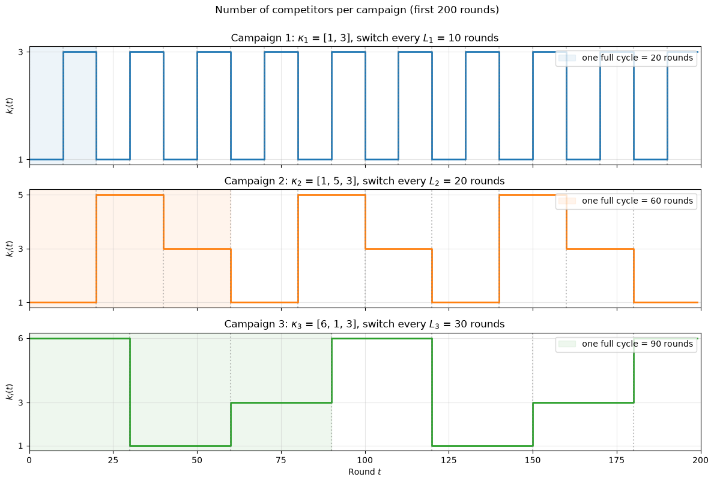 | 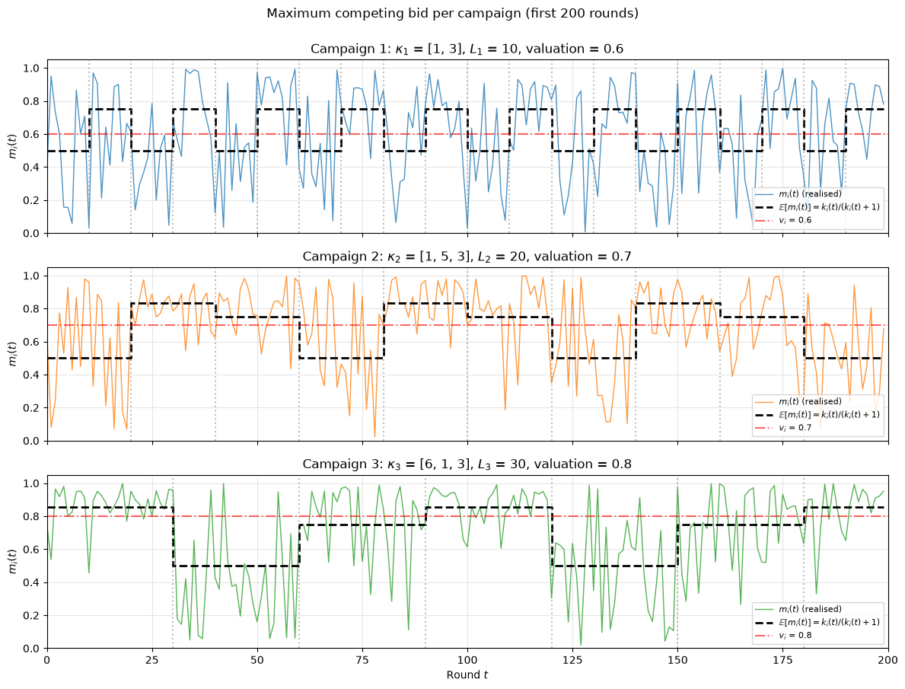 |
| The number of competitors `k_i(t)` per campaign switching regime every `L_i` rounds (first 200 rounds shown). | Realized `m_i(t)` on the non-stationary sequence, with each regime's mean and the valuation `v_i`. |
| 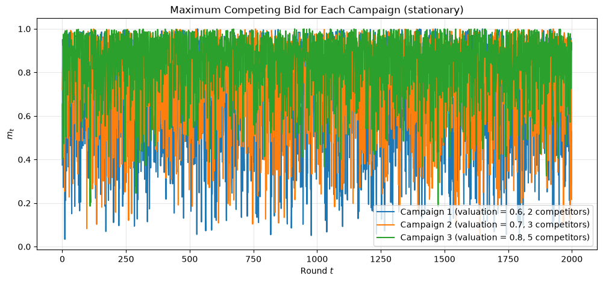 | 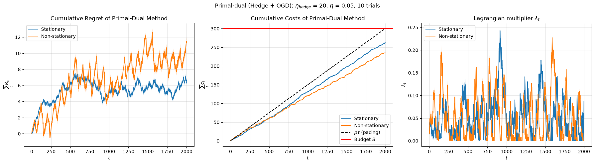 |
| The stationary (Requirement 2) environment for comparison: `m_i(t) ~ Beta(k_i,1)`, `k = (2,3,5)`. | Regret on both environments: `≈ 6.3` (stationary) and `≈ 11.3` (non-stationary) at `T = 2000`. |
| 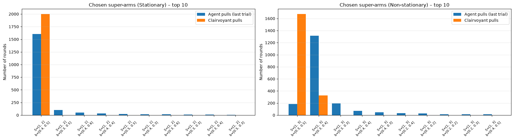 | |
| Super-arms actually played vs. the clairvoyant's: the agent converges to (or closely tracks) the optimal super-arm in both settings. | |

## Requirement 4 — Slightly non-stationary environments with multiple campaigns

**Notebook:** [`requirement_4.ipynb`](requirement_4.ipynb)

A gentler form of non-stationarity than Requirement 3: the horizon is split into a handful of
long **phases** (4 phases of 400-600 rounds each), each with its own fixed `k_i` per campaign —
so within a phase the environment is a proper stochastic bandit, long enough to be learned
before the next phase starts. The benchmark is the best *policy* in hindsight (the clairvoyant
LP solved once per phase), which is strictly stronger than the fixed-strategy benchmark of
Requirement 3.

Three algorithms are compared, all under the same full-feedback assumption as Requirement 3:

- **Combinatorial-UCB with a sliding window (SW-CUCB)** — extends Requirement 2's learner by
  estimating each base arm only from the last `W` rounds, so it forgets stale, pre-breakpoint
  data.
- **Combinatorial-UCB with change detection (CUSUM-CUCB)** — keeps all samples since the last
  detected change per base arm, and resets a base arm's statistics when a CUSUM detector fires
  on it, so it doesn't pay a constant "forgetting" cost inside a phase.
- **The primal-dual method of Requirement 3**, run unchanged, as a robustness baseline: it has
  no forgetting mechanism, so its regret is expected to grow at each breakpoint rather than
  stay flat.

| | |
|---|---|
| 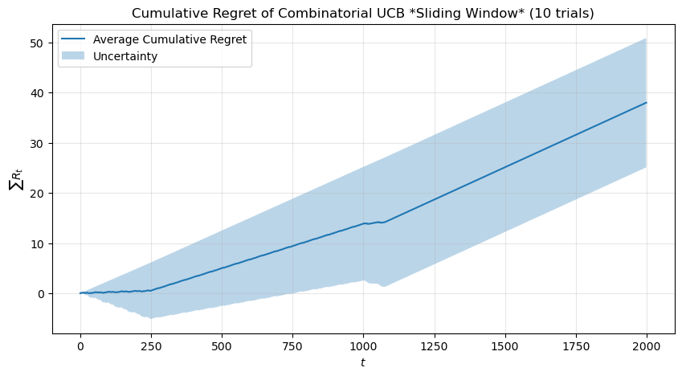 | 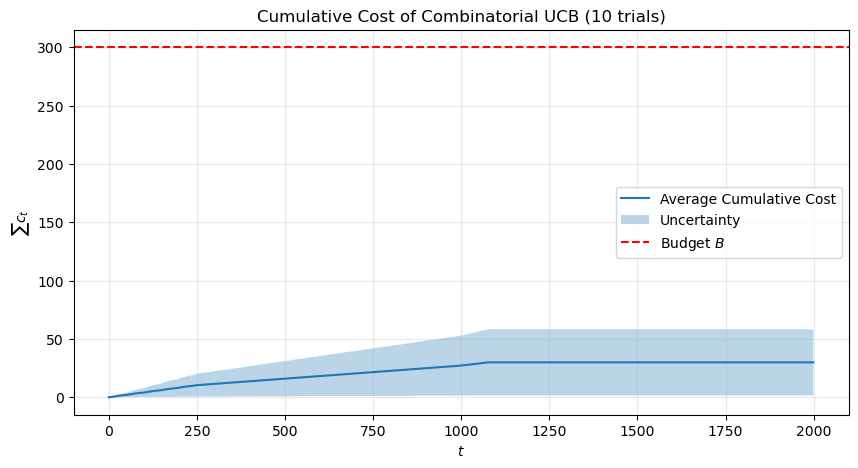 |
| Regret of SW-CUCB against the best-policy-in-hindsight benchmark — flat inside each phase, rising just after each breakpoint. | Cumulative spend of SW-CUCB, tracking the pacing line `ρ·t`. |
| 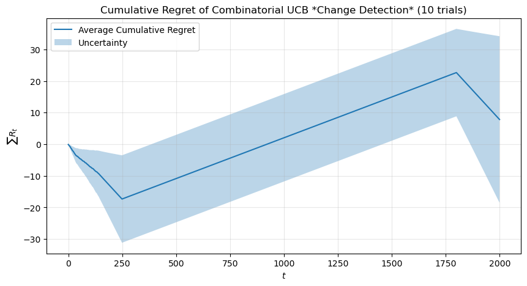 | 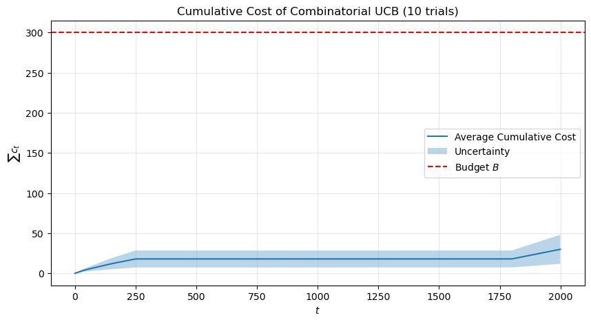 |
| Regret of CUSUM-CUCB. | Cumulative spend of CUSUM-CUCB. |

## Presentation

[`Latex_presentation/presentation.tex`](Latex_presentation/presentation.tex) is a Beamer deck
(PoliMi "Auriga" theme) that walks through the shared setting and all four requirements using
the figures listed above (see [`Latex_presentation/figures/`](Latex_presentation/figures)).
Compile it with `pdflatex`/`xelatex` from inside the `Latex_presentation/` folder.

## Reference material

- [`Slides/`](Slides) — the course's own lecture slides (stochastic and adversarial MABs,
  dynamic pricing, auctions, combinatorial bandits, OGD, non-stationary bandits) plus
  `Online_Learning_Notes.pdf`.
- [`Practical Sessions-20260724/`](Practical%20Sessions-20260724) — the ten lab notebooks
  (`01_stochastic_mabs.ipynb` … `10_nonstationary_bandits.ipynb`) that the algorithms in this
  project extend (UCB1, combinatorial bandits, primal-dual pacing, sliding-window/CUSUM UCB).

## Running the notebooks

The notebooks only rely on standard scientific-Python packages:

```
numpy scipy matplotlib seaborn networkx
```

Install them (e.g. `pip install numpy scipy matplotlib seaborn networkx`) and open any
`requirement_*.ipynb` with Jupyter.
